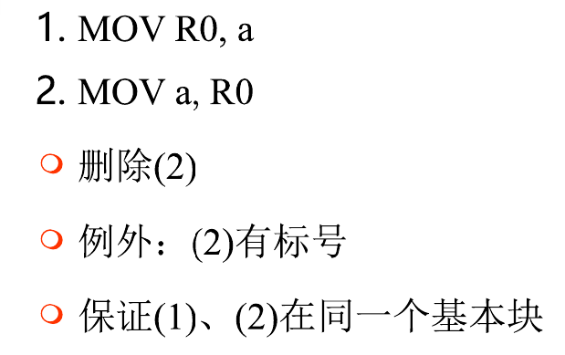
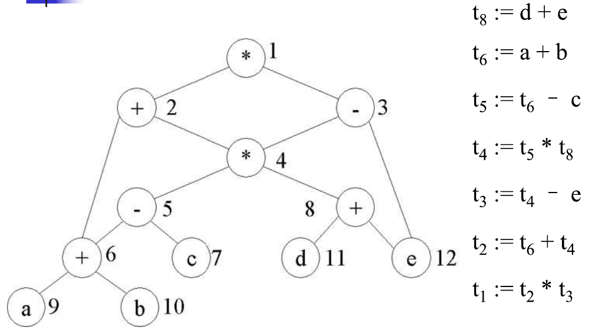
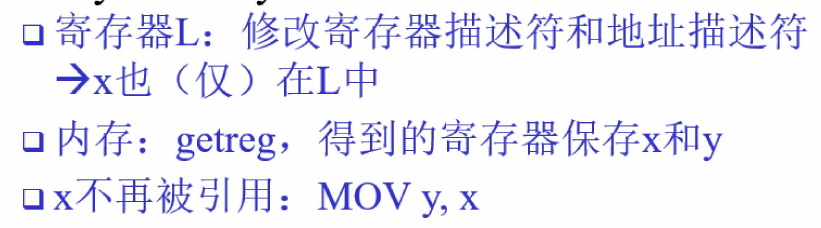
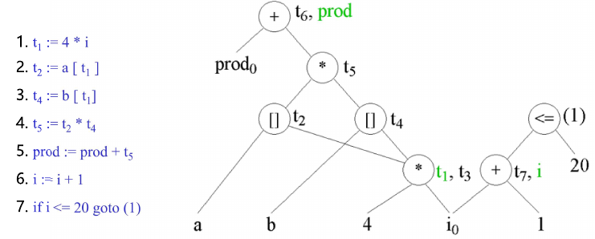

# 小题

## 编译器前置知识

### 概念

#### CFG相关

- $\sum$：有穷字母表
- **符号串**：$\sum$中符号构成的有穷序列
- $\epsilon$：不包含任何符号的序列，空字
- $\sum^*$，符号串全体，包括$\epsilon$
- $\phi$​：空集
- **CFG定义**：四元组$(V_T, V_N, S, P)$
  - $V_T$：非空有限集，终结符集合
  - $V_N$​：非空有限集，非终结符集合
  - $S$：开始符号
  - $P$：产生式集合
- **单词串**：0个或多个单词构成的序列
- **二义性**：一个单词串有多个最左或者最右推导

## 词法分析

### 概念

- token：单词，词法分析出的字符串集元素

- pattern：描述字符串组成token的规则，例如正则表达式

- lexeme：词素，实际运行时匹配的字符串对象

- 词法错误修正：删除、插入、替换、交换字符；最短编缉距离

- 缓冲技术：

  - 实现方式：自动生成工具、高级语言手工编码、汇编编程
  - 双缓冲技术：异步I/O，缓冲区1分析时，缓冲区2读取磁盘
  - 哨兵技术：缓冲区末端添加标记，减少边界判断

- 字母表：alphabet，符号的有穷集合

- 符号串：string，字母表中符号组成的有穷序列

- 字符串相关概念：

  | 术语                               | 定义                        |
  | ---------------------------------- | --------------------------- |
  | s的前缀（prefix)                   | s的前n个字符构成的符号串    |
  | s的后缀（suffix）                  | s的后n个字符构成的符号串    |
  | s的子串（suffix）                  | s除去前缀与后缀得到的符号串 |
  | s的真(proper）前缀、真后缀、真子串 | 不包含s本身                 |
  | s的子序列                          | s中删除符号得到的符号串     |

- **语言**：字母表上的任意符号串集合；$\Phi$空语言，$\{\epsilon\}$​只含空字

- 正规式等价：两个正则表达式表示的语言相同

- **正规式的能力**：

  - 只能表示有限重复或者一个给定结构的无限重复
  - 不能表示$\{wcw\}$​、平衡或嵌套的结构

- **NFA**：非确定有限自动机

  - 形式化定义：$M=\{S,\sum,\delta,s_0,F\}$
    - $S$：有限状态集
    - $\sum$：有穷字母表
    - $\delta$：$S\times\sum \to 2^S$，状态转移函数
    - $s_0$：唯一的初态
    - $F\subseteq S$：终态集合，可为空
  - 占用内存少$O(|r|)$，速度慢$O(|r|*|x|)$

- **DFA**：确定有限自动机

  - 形式化定义：与NFA一致，但$\delta:S\times \sum \to S$
  - 占用内存多$O(|2^r|)$，速度快$O(|x|)$

## 语法制导翻译

### 概念

- **翻译**：为生成代码，保存语言结构的类型、代码位置、数量等信息
- **注释语法分析树**：在语法分析树的节点上标记对应的语法信息，这些信息可以由语法制导定义或者翻译模式得到
- **翻译模式**：在产生式的符号间穿插语义动作，指明了语义动作执行顺序
- 扩充CFG：语法符号添加属性、产生式添加语义规则

### 编译时内存分配

- 根据依赖图来计算属性计算顺序，用以定义内存分配
- 属性生存期：从该属性第一次被计算到所有依赖它的属性都计算完成
- 只在属性生存期内为该属性分配内存

### 内存分配算法

有一个寄存器池：$r_1, r_2,\cdots$

```
for (m in [m_1,m_2,...,m_N]):
	for (m时生存期结束的节点n):
		标记n的寄存器
	if(寄存器r被标记):
		去除r的标记
		将r分配给m，计算m
		将标记的寄存器放回寄存器池
	else:
		从寄存器池为m分配一个寄存器，计算m
	if(m的生存期已经结束):
		将m的寄存器放回寄存器池
```

### 避免属性拷贝

- 当两个节点的值相等时就不用拷贝，直接借用寄存器
- 算法与内存分配算法一致，唯一的区别是要检测拷贝规则，假设相等即等价，要求等价类释放后寄存器才可释放
- **多栈避免拷贝**：通过多个栈来确定来避免拷贝到一个固定的栈中去


## 语法分析

### 概念

- 预测分析：
  - 递归下降分析：递归分析，实际匹配的是终结符
  - 预测分析：通过一个超前符号来唯一确定产生式
- 推导：描述文法定义语言的过程，按照一定的顺序推导出目标串
  - 形式化定义：$\Rightarrow$ 一步推导，$\overset{+}{\Rightarrow}$ 一或多步推导，$\overset{*}{\Rightarrow}$​ 0或多步推导
  - 句型：$S\overset{*}{\Rightarrow}\alpha$，$\alpha$​即为一个句型
  - 句子：不包含NT的句型
  - 最左（右）推导：总是替换最左（右）边的NT
  - 最左句型：最左推导的句型
  - 语法树：推导的图示，不体现推导过程的顺序
  - **一棵语法树对应可多个推导，但只可对应唯一最左推导、唯一最右推导**

- **从表达能力上讲，**$正则语言\subset CFG$​
- **NFA状态在CFG中的含义**：一般为从某个状态到终态路径上的符号串集合，不过实际可以任意定义
- **在LR分析的过程中，句柄始终在栈顶，在没有识别到句柄前一定是活前缀**
- 移进-归约冲突：即在该状态下既可以选择归约，也可以移进
  - 解决：强制使用某种动作

- 归约-归约冲突：类似
  - 解决：设法区分几个可能的归约方式


### 特点分析

- **算符优先分析方法**：
  - 优点：简单、适合表达式分析
  - 缺点：多优先级符号难以处理（'-'）、文法与分析器结合不紧密、仅使用于少数文法
  - 错误：栈顶终结符与输入的下一个输入终结符无优先级关系，即在优先级表中表项为空（移进／归约错误）；句柄与任何产生式右部不相同（归约错误）
  - 错误处理：
    - 保证移进，确保移进的对象都有优先级关系，可能需要删除一些词（栈顶或者输入）
- **LR分析方法**：
  - 优点：可识别所有程序语言结构；最通用的非回溯移进-归约算法；可分析文法范围大于预测分析法；错误检测迅速
  - 缺点：手工实现繁琐，一般使用自动生成工具

### LR分析表的压缩

- action表的压缩：
  - 特点：很多行是相同的
  - 表示方式：一个状态一行action，指针数组$[输入,动作]$，空的部分都用$[\text{any},\text{error}]$表示
  - 可以将相同行的状态压缩到一起，即这几个状态共享相同的动作序列
  - 例如0,4,6,7的action行均相同，共享：$(id,s5),((,s4),(\text{any},\text{error})$
- goto表压缩：
  - 特点：每列的表项很少，很多状态都没有goto
  - 表示方式：按列压缩，每列用列表存储，指针数组$[状态，转移]$，并用正常项代替error项
  - 例如F存在转移：$(7,10),(6,3),(5,3),(4,3)$，则可以压缩为$(7,10),(\text{any},3)$​

### 使用二义性文法

- 缺点：不适用于LR，导致移进／归约、归约／归约
- 优点：
  - 简化表达式，表达更自然，速度更快
  - 区分普通语法与特殊优化情况
  - 可以通过消除歧义规则来去除表达的二义性
- 做法：
  - 获取LR的项目集规范族，并做出分析表
  - **对于表中出现的二义性行为（即表项有多个），根据优先级来清除多余的表项：**
    - 若$E\to E\ \text{op}\ E$：且当前输入符号为$\text{op}$
      - 若$\text{op}$为左结合，则归约
      - 否则移进
    - 若$E\to E\ \text{op}\ E$：且当前输入符号为$\text{op'}$
      - 若$\text{op}$优先级更高，则归约
      - 否则移进
  - 虚悬else二义性：
    - 即$A\to A | AB | \cdots$，计算出的结果必然二义性
    - 根据实际要求来去除二义性表项

## 类型检查

### 概念

- 静态检查：
  - 类型检查
  - 控制流检查：break与while for switch等关系...
  - 唯一性检查：定义唯一
  - 名字关联性检查：相同名字不同位置
- 名字等价：两个类型表达式的名字相等，在类型图中表现为相同的结点
- 结构等价：两个类型表达式的结构相等，在类型图中表现为两张类型图完全相同（递归地比较）

### 编码类型表达式

- 加速等价性检查：
  - 二进制串不等即不结构等价
  - 不同类型可能为相同二进制串：例如下标范围以及函数参数
- 记录编码：
  - 在类型表达式用记录作为基本类型
  - 用另一个二进制串编码其内容

### 类型图的回路

- 原因：存在指向记录的指针
- 解决方案：对除记录以外的类型使用结构等价，结构等价遇到记录则停止，从源头上避免了出现回路的可能

### 类型转换

- 存在隐式转换与显式转换，在编译期间进行，一般要求保留信息
- 类型转换的函数：inttoreal

### 函数和操作符重载

- 重载符号：即同一个运算符对于不同的运算数有不同的解释

- 重载解析：在某个特定上下文来确定符号的含义

- 唯一类型确定：完整表达式必须有唯一类型，自顶向下确定，实际上能确定一组可行类型，通过语义规则进一步确定

- 多态函数：对于不同的调用，参数可以不同

- 包含多态函数的语言：
  - 使用$\forall$来表示多态，即$Q\to \forall \text{type\_variable}.Q|T$，例子：$\forall \alpha.pointer(\alpha)\to \text{integer}$
  - 类型检查：需要实例化之后才能检查

- 代换：即实例化的过程，为多态的类型表达式变量赋值

- 合一：即存在一个变换使得$S(t_1)=S(t_2)$​，变换完的结果即合一结果

- 合一算法：

  1. 绘制出两个类型表达式的类型图，共享所有可共享节点，不一定要画在一起（太乱，可以标注）

  2. 从类型图的顶部开始（应当会有一个顶部节点，从这个节点往下dfs），开始对应着进行unify操作：

     假设目前unify的点为$a, b$

     - 若$a==b$，则返回真
     - 若$a$的类型与$b$的类型相同，合并，以$a$作为代表节点（即$b$节点的标注换为$a$）
     - 若$a$与$b$​为同类型的操作符，合并，并递归比较操作数
     - 若$a$与$b$​中有一个是类型变量，则类型操作符或基本类型成为代表节点

## 中间代码生成

### 重用算法

1. 使用一个计数器c维护变量关系
2. 若使用临时名字作为运算对象，则c--；若生成新的临时名字，则分配\$c，并且c++

### 数组寻址

- 单维数组：$A[i]$，访问$i*w+(\text{base}-\text{low}*w)$，其中$w$为元素大小，$\text{low}$为低地址偏移，$()$项可以预计算
- 多维数组：$A[i_1,\cdots,i_M]$，访问$w*\sum_{j=1}^{M}(i_j*\prod_{k=j+1}^{M}{n_k})+\text{base}-\sum_{j=1}^{M}(low_j*\prod_{k=j+1}^{M}{n_k})$​，后者可以预计算，此处是行优先规则，可以现推
- 累积方式：$e_m = e_{m-1}*n_m + i_m$，这种方式只适用于访问具体数组元素的情况，想访问某一行需要将后面的偏移均置为0

### backpatching

即布尔表达式生成转移语时留空，控制流语句确定地址时来填空（混合翻译模式）

## 代码生成

### 概念

- 地址描述符：描述id与地址的对应关系
- 寄存器描述符：描述id与寄存器的对应关系

### 保持语句顺序

- 前数组赋值，后同一数组的元素计算、赋值
- 前数组元素计算，后同一数组元素的赋值
- 前函数调用、利用指针间接赋值，后使用任何标识符
- 前任何标识符计算，后函数调用以及利用指针间接赋值

### 窥孔优化

- 窥孔：目标代码的一个小的移动窗口

- 冗余的load与store：

  

- 不可达代码

- 控制流优化：合并一些控制流

- 代数优化：赋值转换成+0

- 强度削弱：开销高的指令转换为低开销指令

- 利用机器特性：例如某些机器支持高效的inc代替+1操作

- 启发式重排算法：

  ```
  while (存在未列出的内部节点):
  	选择未列出的节点n，其父节点均已列出
  	列出n
  	while (n的最左孩子m的所有父节点已经列出，且不是叶节点):
  	列出m
  	n = m
  ```

  

# 大题

## 词法分析

### 自动机设计

提供两种思路：

- 思路一：
  1. 先做初态
  2. 状态变化确定转移以及新的节点
- 思路二：
  - 按照设计需求创建所有节点
  - 设计状态转移

#### 问题

***设计能被3整除的二进制串***

思路：假设从左到右读入串，遇到1即当前数\*2+1，遇到0即当前数\*2；而对于一个数判断对3整除显然只要3种状态（3N,3N+1,3N+2）这样就能轻易设计出结果


### 正规式到NFA构造

- 连接：$L(s)L(t)$，，采用overlap的方式，即共享一个节点，不再使用$\epsilon$​边转移
- 其余构造很简单，不做赘述

### NFA到DFA构造

- $\epsilon\text{-closure}(s)$：从$s$出发以及仅通过$\epsilon$边能到达的状态集合
- $\epsilon\text{-closure}(T)$：$\cup\ \epsilon\text{-closure}(s), s\in T$​
- $\delta(T, a)$：$\cup\ \delta(s, a), s\in T$​

### 正规式到DFA构造

这些概念建立在正规式语法树的基础上，**对所有的叶节点标记位置**

- nullable(n)：n是否可以为空
- firstpos(n)：n的开头可能节点位置集合
- lastpos(n)：n的结尾可能节点位置集合
- followpos(n)：n的后继可能节点位置集合

$\text{firstpos}$计算方式：

| 结点n                                                        | nullable(n)                                            | firstpos(n)                                                  |
| ------------------------------------------------------------ | ------------------------------------------------------ | ------------------------------------------------------------ |
| n为$\epsilon$叶节点                                          | $\text{true}$                                          | $\Phi$                                                       |
| n是位置$i$的叶节点                                           | $\text{false}$                                         | ${i}$                                                        |
|  | $\text{nullable}(c_1)\text{ or }\text{nullable}(c_2)$  | $\text{firstpos}(c_1)\cup\text{firstpos}(c_2)$               |
|  | $\text{nullable}(c_1)\text{ and }\text{nullable}(c_2)$ | $\text{firstpos}(c_2)\ \text{if}\ \text{nullable}(c_1)\ \text{else}\ \text{firstpos}(c_1) $ |
|  | $\text{true}$                                          | $\text{firstpos}(c_1)$                                       |

对于lastpos的计算是一样的，只需要交换$c_1, c_2$

$\text{followpos}$计算方式：

| 结点n                                                        | follow(...)                                                  |
| ------------------------------------------------------------ | ------------------------------------------------------------ |
|  | $\text{followpos}(i)\cup=j, j\in \text{firstpos}(c_2), i\in \text{lastpos}(c_1)$ |
|  | $\text{followpos}(i)\cup=j, j\in \text{firstpos}(c_1), i\in \text{lastpos}(c_1)$ |

**构造状态机算法**：

1. 构造扩充正规式$(r)\#$对应的语法树$T$

2. 对$T$进行dfs，计算$\text{nullable, firstpos, lastpos, followpos}$

3. 按照构造算法构造转移与状态，初态为$\text{firstpos}(\text{root})$，包含$\#$​的状态即为终态

   ```
   worklist = [firstpos(root)]
   while(worklist not empty):
   	T = pop from worklist
   	set T to be visited
   	for (c in chars):
   		U = 广义并 followpos(p), p在T中，且对应位置字符为c
   		if(U not empty and not visited):
   			将U加入worklist中
   		Dtran[T, a] = U;
   ```

   其实就是工作表算法

### DFA最小化

即划分，划分的思想是：***如果节点内的点行为不等效，那么对于给定的输出，就不能确定唯一的有向边，因而必须要进行划分***。

### 模拟NFA

即NFA的分析流程

### 语法树表示正规式

即正常的语法树构造逻辑，其中\*为单目运算符，其余均为双目，连接用$\cdot$​表示


### 状态转换表压缩

此处不提供，见课件3 p.188~189

## 语法制导翻译

### 翻译模式设计

具体的说，就是在产生式的符号间穿插语义动作，一般是`{print('+');}, {print(id);}`等动作

设计取决于实际的需求，注意必须满足L-属性定义（一定能构造出这样的模式）

**设计方式：**

- 继承属性：将某个计算值向下传递，其目的是将部分计算结果下传，以计算出新的结果

- 综合属性：将计算结果向上传递，其目的是传递最终的计算结果

- 方法：

  - $A\to X\{R.i = f(X.x)\}R\{A.a=R.s\}$
  - $R\to Y\{R_1.i=g(R.i,Y.y)\}R_1\{R.s=R_1s\}$
  - $R\to\epsilon\{R.s=R.i\}$

- 例子：消除左递归

  

### 翻译模式的注释语法树

其流程与搭建语法分析树是一致的，并且将所有的语义动作也当作语法树的节点，但边采用虚线形式以区分动作与节点

*例子：将9-5\*2翻译为前缀表达式*

|  |  |
| ------------------------------------------------------------ | ------------------------------------------------------------ |

### 依赖图

1. 对语法树中的每个节点，为其所有属性创建节点
2. 对语法树中的每个节点，通过语义规则创建边的依赖关系，$a\to b$代表$b$依赖于$a$​

### 自底向上计算L-属性定义

1. 重点在于引入标记，对于某些不能预测继承属性在栈上位置的情况，需要添加标记M，例如$A\to BCD\\A\to BD$，且$D$的继承属性来自于$A$，此时不能确定$A$的属性位置，需要改写为$A\to BCMD\\ A\to BND\\ M\to \epsilon$，$M$的目的是中转$A$的属性，以提供给$D$，**需要确保的是，通过$M$修改之后，$D$对$A$的属性位置唯一确定**
2. 在确保语义规则的基础上，将原来的语义规则转换为栈上的代码片段即可

## 语法分析

### 平凡算法分析

1. 初始状态以开始符号为根节点，输入指针指向第一个单词
2. 对于NT节点，选择产生式，尝试构造孩子节点，失败则回溯
3. 对于T节点，与当前输入单词比较，如果匹配则指针后移，不匹配则回溯或报告错误

### NFA到CFG

1. $状态i\to非终结符A_i$：$A_0, \cdots, A_n$

2. | $转移\to 结果$                                               |
   | ------------------------------------------------------------ |
   |  |
   |  |

3. 若$i$为终态，则$A_i\to\epsilon$

4. 若$i$为初态，则$A_i$​为开始符号

5. 完成后，可能要去除一些无用的状态，这些状态在NFA中可能是多余的

### 消除$\epsilon$产生式

利用产生式直接代入即可

### 消除回路

回路的原因是$\epsilon$的存在，使得能够从一个更复杂的产生式推回一个简单的产生式，例如$S\Rightarrow SS\Rightarrow S$

只需要确保每个产生式都加入终结符即可解决

### 提取左公因子

1. 对每个非终结符$A$，寻找多个候选式的最长公共前缀$\alpha$
2. 若$\alpha\ne\epsilon$，则将所有候选式改写为$A\to \alpha A^{'}\\A^{'}\to\beta_1|\beta_2|\cdots$

### 递归下降的预测分析法

需要先改写文法，然后使用状态机

1. 改写文法：消除左递归、提取左公因子，确保能唯一确定使用的产生式
2. 状态机：
   1. 为每个NT $A$创建TD
   2. 对产生式$A\to X_1\cdots X_n$，创建一条从初态到终态的路径，边标记为$X_1,\cdots,X_n$​
   3. 进行分析：
      - 存在边$s\overset{a}{\to}t$，状态从$s$转换到$t$，输入缓冲指针前移
      - 存在边$s\overset{A}{\to}t$，转移到$A$的初态，输入缓冲指针不变，继续读入符号并转移状态，当到达$A$的终态则退回到$s\overset{A}{\to}t$，并转移到$t$
      - 存在边$s\overset{\epsilon}{\to}t$，状态从$s$转换到$t$​，输入缓冲指针不动
3. 可能的化简：如果在某一步获取到了跟目标TD相同的输入，则添加一个回边$\epsilon$，并尝试化简，化简过程即消去冗余的$\epsilon$边，并重排可能的终结状态

### 移进-归约分析

#### 一般方法

1. 将输入符号移入栈中，直到形成一个句柄
2. 归约句柄为对应的非终结符并压入栈中
3. 不断重复1~2两步，最终输入为空，且栈中只有\$E（E为起始符号），接受
4. 否则拒绝或者错误处理

#### 构造优先级函数

1. 对每个非终结符$a$或$\$$创建符号$f_a$和$g_a$
2. 将创建的符号划分为尽可能多的组：
   - 若$a\overset{\cdot}{=}b$，则$f_a$与$g_b$分在一组
3. 创建有向图：
   - 对任何$a, b$
     - 若$a\lessdot b$，$g_b$向$f_a$引一条边
     - 若$a\gtrdot b$，$f_a$向$g_b$引一条边
     - $f_a$到$g_b$的边满足：$f(a)>g(b)$​，反之亦然
4. 通过有向图获取优先函数：
   1. 有向图存在回路，则不存在优先级函数
   2. 否则
      - $f(a)=f_a所在组开始的最长路径长度$
      - $g(a)=g_a所在组开始的最长路径长度$

#### 算符优先分析

```
设置ptr指向w$的第一个符号
stack = []
while(true):
	if(栈顶为$且ptr指向$):
		return
	else:
		a = stack.top()
		b = *ptr
		if(a < b || a == b):
			stack.push(b)
			ptr = ptr->next
		elif(a > b):
			while(!(stack[-2] < stack.pop())):
				continue
        else:
        	error()
```

## 中间代码生成

### 构造布尔表达式的翻译模式


### 带控制流的翻译

#### case语句翻译

- 方式一：跳转到test块来匹配具体的模式并跳转处理
- 方式二：跳转到case的第一个块比较，不行就第二个，以此类推

## 代码生成

### 代码生成算法

对于语句`x:=y op z`

1. 为计算结果分配一个reg，名称为L
2. 查询y的寄存器y'，若y'!=L，则`MOV y', L`
3. `OP z', L`
4. `L`即计算结果，若y,z不再使用，则可从寄存器描述符中删除

特例：

- 如果为一元运算，删去算法中z的部分即可

- 如果为赋值：？？？

  

### getreg算法

对于`x:= y op z`，为x分配位置L

1. 与y占用相同的寄存器：要求如下

   - y的寄存器不包含其他名字
   - y不再活跃且不再被引用

2. 寻找空寄存器

3. 找不到则寄存器替换

   - ？？？

     

4. x不再被引用，或没有合适寄存器则内存

### 基本块的DAG构造

很简单，跟之前的类型图DAG以及语法树转语法图是一样的，唯一的区别在于，对于goto指令需要在旁边额外标出一个值，因为这个指令是三目的



### 动态规划寄存器分配算法

1. 对于表达式树的每个节点n，计算以n为根的子树的最优计算开销，考虑使用内存、一个寄存器、两个寄存器的开销
2. 遍历T，根据C[i]确定哪些子表达式结果必须保存到内存
3. 生成代码
